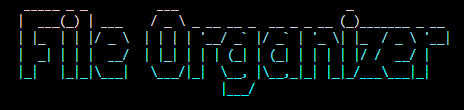
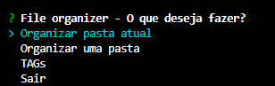
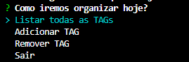

File organizer te ajuda a organizar os arquivos de uma pasta em um conjunto de pastas, como *documentos, imagens, executaveis e arquivos compactados*, de acordo com a extensão do arquivo ( .pdf, .docx, .xslx, .zip, .png, .jpeg).

Tambem realiza a organização dos arquivos de acordo com as tags cadastradas pelo usuário, que tambem indicam o caminho da pasta que deverá armazenar os documentos salvos com aquela tag. Ao mover os documentos, a tag é removida, procurando manter o nome original do documentos, fazendo com que a tag seja utilizada apenas para guiar a organização.

#
#

## Como Usar

Para usar é necessário ter instalado o Node.js, tendo ele instalado, basta abrir um terminal de comando dentro da pasta do programa e selecionar as opções.

### TAGs

Será necessário alterar o caminho da pasta das tags usadas para o desenvolvimento, para isso, utilize o menu de `TAGs`:

